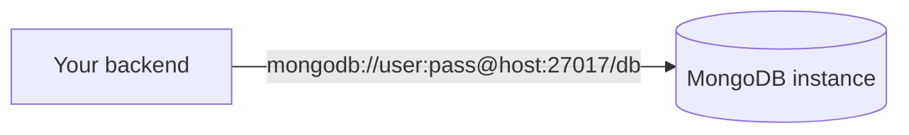

Each project can provision MongoDB instances for document-oriented data — content, catalogs, event logs, anything that doesn't fit neatly into rows and columns. Like Redis, and unlike Postgres, **you connect to MongoDB directly** with the native driver, rather than through a MassiCloud REST proxy.

MassiCloud runs [Percona Server for MongoDB](https://www.percona.com/mongodb/software/percona-server-for-mongodb) 7.0 under the hood — a drop-in, fully open-source MongoDB build.

## Direct connection model

Postgres is mediated through PostgREST because it needs per-request authorization (Row Level Security) for end-user-facing queries. MongoDB instances are for your own backend, not queried directly by end users, so MassiCloud gives your app a connection string instead of proxying every operation through HTTP — the same reasoning as [Redis](/concepts/redis/).



Every instance gets **two** connection strings, both shown in the portal (masked, with a reveal toggle):

- **Service** — read/write. Use this from your backend.
- **Readonly** — read-only. Use this for reporting jobs, analytics, or anything that should never be able to mutate data.

Treat both the same way you'd treat a database password: never ship them to a browser or mobile client.

## What's included

- A dedicated, isolated MongoDB instance per stage (the same isolation model as Postgres and Redis)
- Full portal UI: a collection/document editor, a query console, and an index manager — so you can inspect and manage data without installing a GUI client
- Schema presets to seed common shapes (a `users` collection with a unique email index, or a `posts`/`comments` blog starter) when you create an instance

## What's not included

- **No REST API.** There's no equivalent of PostgREST for MongoDB — use the native driver for your language.
- **No SDK wrapper.** The MassiCloud SDKs don't have a Mongo module; install your language's official `mongodb` driver and connect with the connection string directly.
- **No built-in auth.** MassiCloud's [authentication](/concepts/authentication/) system is Postgres-specific (`auth.users`, RLS policies). If you need user accounts alongside a Mongo database, handle auth in your application code, or use a Postgres instance for auth and Mongo for everything else.

## Connecting

```ts
import { MongoClient } from 'mongodb'

const client = new MongoClient(process.env.MONGO_URL!) // the "Service" connection string
await client.connect()

const db = client.db('appdb')
await db.collection('users').insertOne({ email: 'user@example.com' })
```

```python
from pymongo import MongoClient

client = MongoClient(MONGO_URL)  # the "Service" connection string
db = client.appdb
db.users.insert_one({"email": "user@example.com"})
```

## Isolation

Each MongoDB instance is its own single-node replica set, scoped to one stage in your project — the same way each Postgres database and Redis cache is its own instance. Data in `staging` and `production` MongoDB instances never overlap.

## Reachability

MongoDB instances are reachable from apps you deploy on MassiCloud (same cluster), using the internal connection string shown in the portal. They aren't reachable from the public internet in this release — if you need to connect from outside the cluster (a local dev machine, a script running elsewhere), reach out to support.
