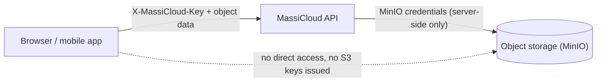
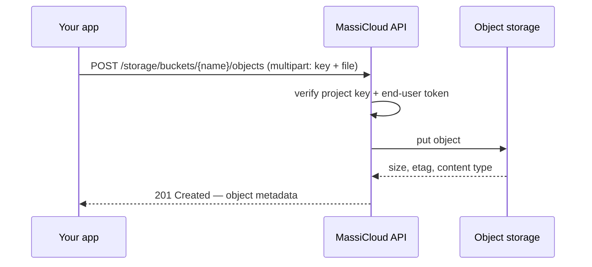
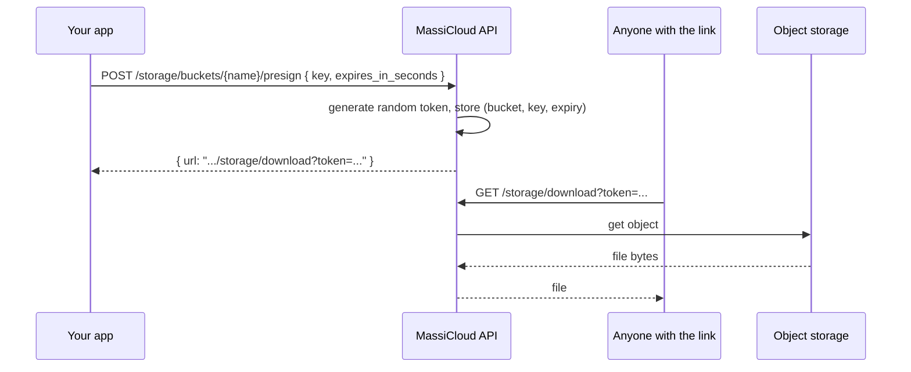

Every project can create buckets for file storage — avatars, exports, user uploads, anything you'd otherwise put in S3. Storage is backed by MinIO, an S3-compatible object store, but **you never talk to MinIO directly**.

## Mediated access

Unlike a typical S3 setup, the client never receives storage credentials. All reads and writes go through the MassiCloud API, which holds the MinIO credentials server-side and proxies the request.

This means:

- There's no access key/secret key pair to rotate, leak, or scope per client.
- Every request is authenticated the same way as the rest of the API — `X-MassiCloud-Key` plus, for writes, a signed-in end user.
- You can add validation, virus scanning, or rate limiting in front of storage later without changing any client code.

## Public vs. private buckets

A bucket is either:

- **Public** — anyone with the anon key can read objects. No end-user sign-in required.
- **Private** — reads require a signed-in end user (`Authorization: Bearer <access_token>`).

Writes (`upload`, `remove`) always require a signed-in end user, on both public and private buckets. Anonymous writes are never allowed.

## Uploading and downloading

Downloads work the same way in reverse: the API streams the object back to the client, so the client only ever needs the project key (and an end-user token for private buckets).

## Signed URLs

Sometimes you want to hand out a link to a file — to embed in an `` tag, share with someone without an account, or pass to a background job — without going through the API on every byte. `createSignedUrl()` solves this without ever exposing MinIO credentials:

The token is a random, single-purpose value tied to one bucket/key/expiry — not a presigned MinIO URL. It's safe to share or hotlink because it can never be used to access anything other than the one object it was minted for, and it stops working after `expires_in_seconds`.

## Next

- [Object storage SDK reference](/sdk/javascript/storage/overview)
- [Storage HTTP API reference](/api-reference/storage)
