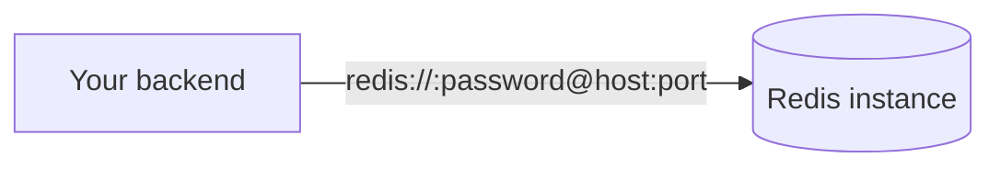

Each project can provision Redis instances for caching, rate limiting, queues, or session storage. Redis instances behave differently from Postgres databases and object storage: **you connect to them directly** with a connection string, rather than through the MassiCloud API.

## Direct connection model

Postgres and object storage are mediated through the API (PostgREST and the storage proxy respectively), because both need per-request authorization (RLS, bucket ownership). Redis has no equivalent per-key authorization model — a Redis instance is a private cache for your backend, not something end-users query directly — so MassiCloud gives your app the connection string directly instead of proxying every `GET`/`SET` through HTTP.



This is why the portal shows the **host**, **port**, and **password** for each instance in the clear (behind a reveal toggle) — they're meant to be copied into your app's environment, not embedded in client-side code. Treat a Redis password the same way you'd treat a database password: never ship it to a browser or mobile client.

## Connecting

Use any standard Redis client for your language, pointed at the connection string shown in the portal:

```bash
redis-cli -h <host> -p <port> -a <password>
```

```ts
import Redis from 'ioredis'
const redis = new Redis('redis://:password@host:port')
```

```python
import redis
r = redis.Redis(host="<host>", port=<port>, password="<password>")
```

```go
rdb := redis.NewClient(&redis.Options{
    Addr:     "<host>:<port>",
    Password: "<password>",
})
```

## Isolation

Each Redis instance is its own container, scoped to one stage in your project — the same way each Postgres database is its own instance. Data in `staging` and `production` Redis instances never overlap.

## What to use it for

- Caching expensive query results
- Rate limiting / throttling
- Session storage for your own backend
- Job queues (e.g. BullMQ, Sidekiq-style workers)

Because Redis is connected to directly, there's no SDK wrapper for it — use whichever Redis client your language's ecosystem already provides.
